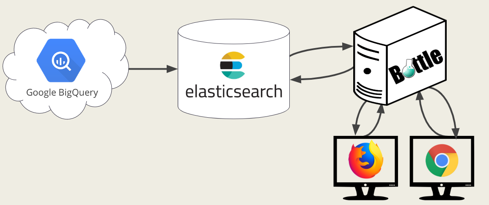

# ExpertDeveloperRecommendation
A tool designed to work as a search engine to find expert developers based on their skills and experience.

- Built a search engine to find expert developers by utilizing GitHub datasets.
- Reduced 3TB of data into merely 600 MB by keeping developer specific information such as (number of commits, first and last commit, average time between commits etc.)

## Overview

## Abstract
Global and distributed software development increases the need to find developers with relevant expertise. At
the same time, online collaborative development tools such as GitHub have become extremely popular and are publicly
providing considerably large datasets on projects and developers. Currently, a variety of algorithms, methodologies and techniques
exists on using collaborative data to recommend expert developers based on knowledge and other criteria. We worked to
adapt as well as extend several of these methods so as to better match the large size of available datasets. Specifically, we created
a tool that can be used as a search engine for expert developers, based on their skills and experience, which are extracted based
on their actual code contributions.

### Github Dataset Properties
  
| Property                 | Size         |
| ------------------------ | -------------|
| number of repositories   | 2.9 million  |
| number of commits        | 215 million  |
| number of file paths     | 2.3 billion  |
| number of file contents  | 163 million  |
| size in disk             | 3+TB         |

### Project Goals

A search engine that:
- can be used to search for expert developers 
- provides search criteria for developers’ skills and experience
- bases results on actual contributions
- uses a very large dataset of possible experts (20+ million)
- search queries are reasonably fast
- can be extended to include more criteria (code quality, bugs introduced, etc.)

#### For Details 
- ExpertDeveloperRecommendation (Report).pdf
